# Introduction:

AI Summarization Agent allows you to quickly extract key points, action items, acronyms, glossary and other important information from a natural human conversations. The produced summary also corrects any gramatical mistakes.

# Mindmap

```mermaid
  mindmap
  root(("`Semantic
  Kernel  🧠`"))
    Inputs
      Conversation.txt
      Plugins
        TextSummarizationFunctionPlugin
          TextSummarizationPlugin.Yaml
          YamlPromptExtentsions
          HandlebarsPromptTemplateFactory
          KernalArguments
    OpenAI
      GPT4.0
      FunctionCalling
    Output
      SummarizedText
```

# Related Article:

https://medium.com/@vamsidogiparthi/ai-summarization-agent-in-7-minutes-738f27c81673
